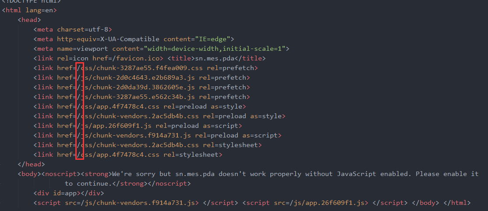
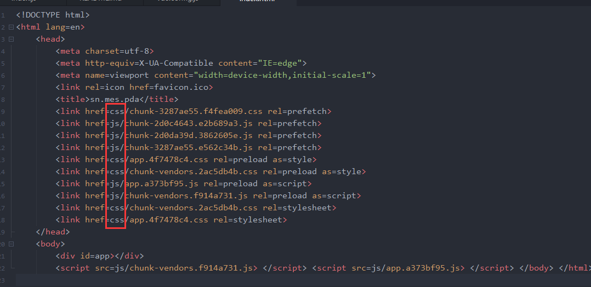
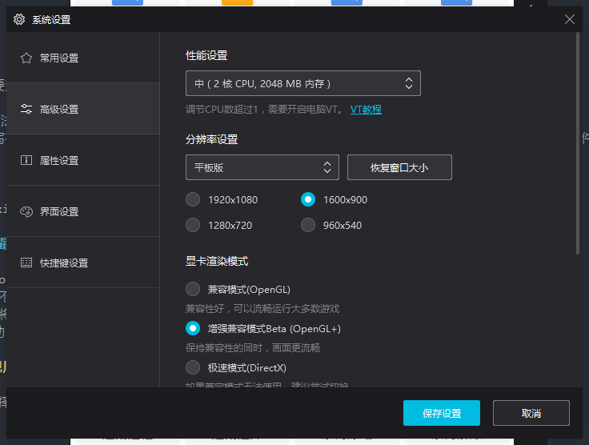
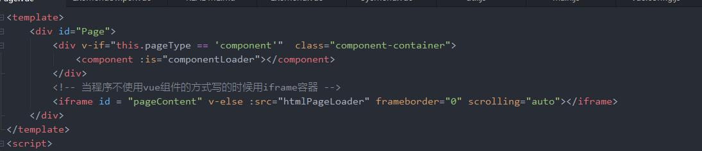
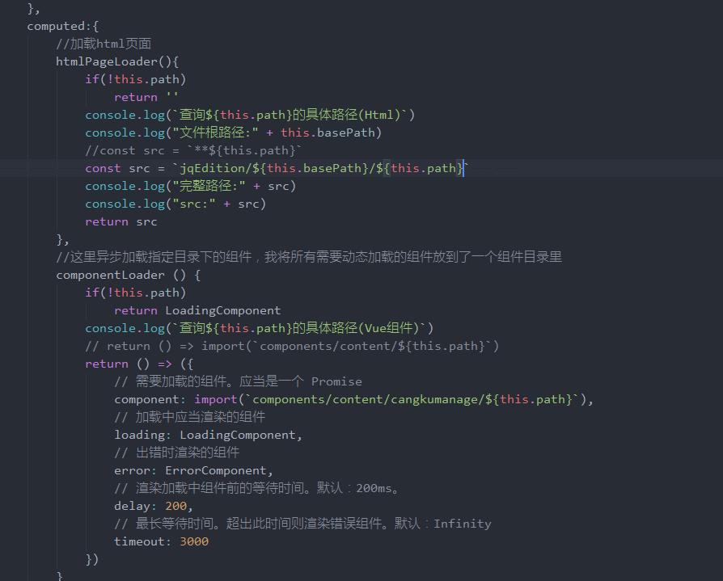
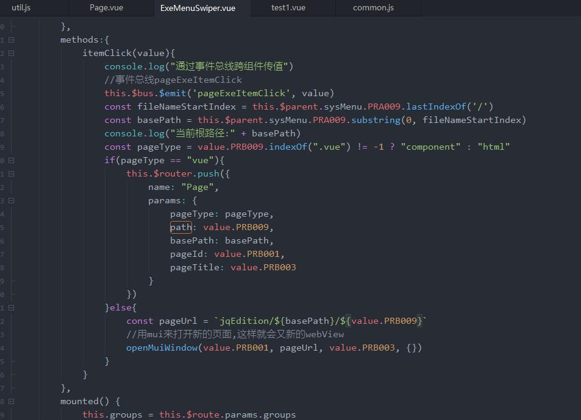

# sn.mes.pda————基于vue 2.6.0版本

## 常见错误

### 通过HBuilder打包成app时,打开页面空白

项目是由vue-cli4生成的

第一步：在vue.config.js中配置，将publicPath设为'./'，如果不修改默认是'/'

第二步：如果用到了vue-router，将mode改成hash，或者注释掉history，其实原本默认就是hash，但是cli生成时会修改成history

### 使用夜神模拟器的时候，屏幕出现局部黑屏

打开设置-高级设置-显卡渲染模式-选择“增强兼容模式Beta”

## 全局混入H5Plus

### 实现方法

参考mixins/mixinPlus.js文件,需要注意的是,当plusReady事件触发开始执行回调函数时。
这里开始的时候犯了两个错误
一：想每个组件都混入一个methods方法plusReady，但是Vue里面方法的混入如果出现同名，组件内的方法会覆盖混入的方法
二：判断plus是否初始化的方法应该写在mounted内，如果写在其他钩子函数内的话,很可能plus已经初始化了开始调用回调方法,但是vue组件仍未被成功创建,回调方法plusReady还没有成功定义

### 程序中如何使用

在需要使用到H5+api的组件内混入mixinPlus对象,并定义一个plusReady方法，当plus初始化成功后会回调该方法

### swiper的高度按照当前内容高度最高的进行赋值，低高度的内容下方存在空白

1、可进行js赋值height或者设置autoheight属性未true
2、设置autoheight属性 当页面高度不足满屏幕时候，内容区域下方空白部分不可进行手滑动，可设置min-height
3、swiper内部设置的fixed定位元素将失效
4、切换tab进行高度赋值时候需要借助 that.$nextTick

## 兼容老版本（Jquery版）遇到的问题

老版本页面嵌入iframe标签

根据文件夹路径进行链接，因为老版本的html文件是与对应子系统文件再同一级别路径下的

### 嵌入的html页面plus无法初始化,只能采用打开新的页面,不能用iframe

plusReady事件仅在webview首次创建时触发，使用mui.openWindow方法多次打开已存在的同样id的webview时，是不会重复触发plusReady事件的； 
因此若业务写在plusReady事件中，可能会出现执行结果和预期不一致的情况；此时可通过自定义事件触发

因为vue是不停的从虚拟DOM中拿元素渲染在页面上，所以只有一个webView，而旧模块是使用mui.openWindow打开新的页面，会产生新的webViewId，
会重新出发plusReady

QQ：295815234
微信：liaohan918